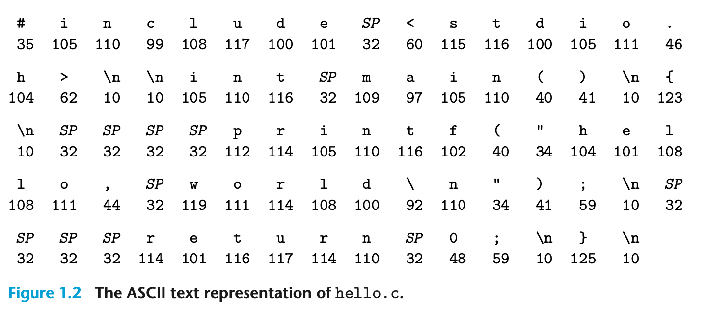
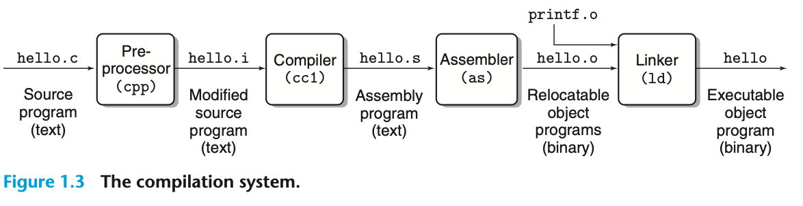
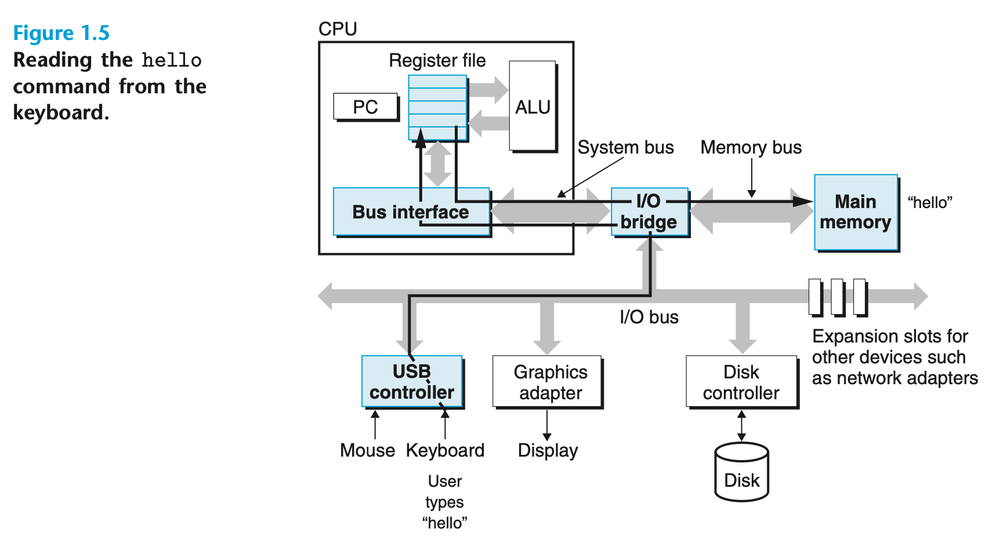
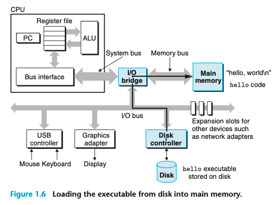
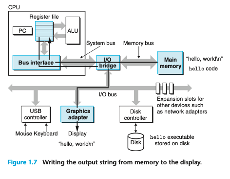
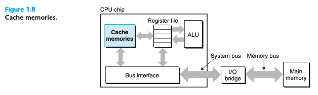
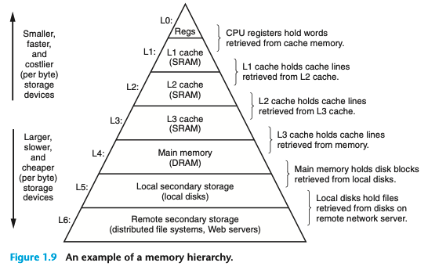
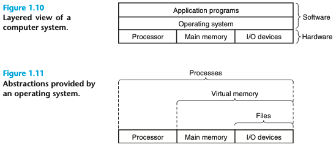

#Chapter 1 A Tour of Computer Systems

電腦系統由硬體和系統軟體組成，兩者合作運行應用程式。隨著時間的推移，系統的具體實作會有所變化，但底層概念依然不變。所有電腦系統都具有類似的硬體和軟體組成元件，並執行類似的功能。這本書專為希望透過理解這些元件如何運作以及如何影響程式正確性和效能的程式設計師而撰寫。

您即將踏上令人興奮的旅程。如果您致力於學習本書中的概念，那麼您將有望成為稀有的人才，也就是「超級程式設計師」，並透過理解底層電腦系統及其對應用程式的影響而變得睿智。

您將學習實用的技能，例如如何避免因電腦表示數字的方式而產生的奇怪數值錯誤。您將學習如何利用現代處理器和記憶體系統的設計來優化您的 C 程式碼。 您將學習編譯器如何實作程序呼叫，以及如何利用這些知識來避免困擾網路和網路軟體的緩衝區溢位漏洞所帶來的安全漏洞。您將學習如何識別和避免連結過程中讓普通程式設計師感到困惑的討厭錯誤。您將學習如何撰寫自己的 Unix shell、自己的動態儲存分配套件，甚至是自己的網路伺服器。 您將學習並行處理的承諾和陷阱，這隨著多個處理器核心整合到單顆晶片上而變得越來越重要。

在 Kernighan 和 Ritchie 的經典 C 程式語言著作中，他們使用圖 1.1 所示的 hello 程式碼向讀者介紹 C 語言。 雖然 hello 是一個非常簡單的程式碼，但系統的所有主要部分都必須協同工作才能讓它執行完成。 從某種意義上來說，本書的目的是幫助您理解在系統上執行 hello 時會發生什麼以及為什麼發生。

我們從追蹤 hello 程式的生命週期開始學習系統，從它由程式設計師建立、在系統上執行、列印其簡單訊息並終止為止。 當我們追蹤程式的生命週期時，我們將簡要介紹關鍵的概念、術語和發揮作用的組件。稍後的章節將擴展這些概念。

~~~
1 	#include <stdio.h>
2
3 	int main()
4 	{
5  		printf("hello, world\n");
6  		return 0;
7	}
~~~

我們用編輯器建立的 hello 程式原始碼（或原始檔），會儲存成一個叫做 hello.c 的文字檔。原始碼是由一連串的位元（bit）組成，每個位元的值為 0 或 1，並以 8 個位元為一組的單位叫做「位元組」（byte）。每一個位元組代表程式碼中的某個文字字符。

大多數電腦系統使用 ASCII 標準來表示文字字元，此標準會用唯一的位元組大小的整數值來代表每個字元。例如，圖 1.2 顯示了 hello.c 程式的 ASCII 表示方式。

hello.c 程式碼會以位元組的序列儲存在檔案中。每一個位元組都有一個整數值，對應到某個字元。例如，第一個位元組的整數值為 35，代表字符 ‘#’；第二個位元組的整數值為 105，代表字符 ‘i’，以此類推。請注意，每一行文字結尾都有一個隱藏的換行符號 ‘\n’，它以整數值 10 表示。像 hello.c 這樣只包含 ASCII 字元的檔案稱為「文字檔」。所有其他檔案都稱為「二進位檔」。

hello.c 的表示方式說明了一個基本概念：系統中的所有資訊，包括磁碟檔案、儲存在記憶體中的程式、存在記憶體中的使用者資料，以及透過網路傳輸的資料，都以一串位元表示。唯一能區分不同資料物件的是我們看待它們的脈絡。例如，在不同的脈絡中，相同的位元組序列可能代表一個整數、浮點數、字串或機器指令。作為程式設計師，我們需要理解機器如何表示數字，因為它們與整數和實數不同。它們是有限的，並且取決於計算機硬體的設計。

#1.2 程式會由其他程式轉譯成不同的形式

hello 程式一開始是以 C 語言的高階程式碼形式存在，因為人類可以用這種形式閱讀和理解它。但是，為了在系統上執行 hello.c，必須由其他程式將個別的 C 語句翻譯成一系列低階的機器碼指令。這些指令會被包裝成一種叫做可執行物件程式（executable object program）的形式，並儲存在二進位磁碟檔中。物件程式也稱為可執行物件檔。

在 Unix 系統上，從原始檔轉譯成物件檔的過程是由編譯器驅動程式（compiler driver）執行的：

~~~ 
bash 

linux> gcc -o hello hello.c
~~~ 

這裡，gcc 編譯器驅動程式會讀取原始檔 hello.c，並將它轉譯成可執行物件檔 hello。轉譯過程按照圖 1.3 所示的四個階段依序進行。執行這四個階段的程式（預處理器、編譯器、組合語言程式轉譯器和連結器）被統稱為編譯系統。

**預處理器階段（Preprocessing phase）：**預處理器（cpp）根據以 ‘#’ 字符開頭的指示來修改原始的 C 程式碼。例如，hello.c 第 1 行的 #include <stdio.h> 指令告訴預處理器讀取系統標頭檔 stdio.h 的內容，並將其直接插入程式碼文本中。結果會產生另一個 C 程式碼，通常會加上 .i 的副檔名。

**編譯階段（Compilation phase）：**編譯器（cc1）將文本檔 hello.i 轉譯成文本檔 hello.s，其中包含了組合語言程式。這個程式包含了 main 函式的以下定義：

~~~
assembly

1	main:
2	  subq $8, %rsp
3	  movl $.LC0, %edi
4	  call puts
5	  movl $0, %eax
6	  addq $8, %rsp
7	  ret
~~~

  這些定義中的第 2-7 行都以文字形式描述了一條低階機器碼指令。組合語言之所以有用，是因為它為不同的高階語言的不同編譯器提供了一個通用的輸出語法。例如，C 編譯器和 Fortran 編譯器都生成相同組合語言的輸出檔案。  

**組合語言階段（Assembly phase）：**接下來，組合語言程式轉譯器（as）將 hello.s 轉譯成機器碼指令，將它們打包成一種叫做可重定位物件程式（relocatable object program）的形式，並將結果儲存在物件檔 hello.o 中。這是一個包含 17 個位元組且編碼成 main 函式指令的二進位檔。如果我們用文字編輯器查看 hello.o，它看起來就像亂碼一樣。

**連結階段（Linking phase）：**請注意，我們的 hello 程式會呼叫 printf 函式，它是每個 C 編譯器提供的標準 C 函式庫的一部分。printf 函式位於一個單獨的預編譯物件檔 printf.o 中，該物件檔必須以某种方式與我們的 hello.o 程式合併。 連結器 (ld) 負責處理此合併。 產生結果是 hello 檔，它是一個可執行物件檔 (executable object file) 或簡稱可執行檔，可以載入記憶體並由系統執行。

> <strong>Aside</strong> GNU專案  
Gcc是GNU（GNU's Not Unix的縮寫）專案開發的眾多有用工具之一。GNU專案是由理查德·斯托曼於1984年發起的一個免稅慈善機構，其雄心勃勃的目標是開發一個完整的類Unix系統，其原始碼不受如何修改或分發的限制。  
GNU專案開發了一個包含Unix作業系統所有主要元件的環境，但核心除外，核心是由Linux專案單獨開發的。 GNU環境包括emacs編輯器、gcc編譯器、gdb偵錯程式、轉譯器、連結器、操作二進位制檔案的實用程式和其他元件。 Gcc編譯器已經發展到支援許多不同的語言，能夠為許多不同的機器生成程式。 支援的語言包括C、C++、Fortran、Java、Pascal、Objective-C和Ada。  
GNU專案是一項了不起的成就，但它經常被忽視。現代開源運動（通常與Linux相關）的知識淵源歸功於GNU專案的自由軟體概念（“自由”如“言論自由”，而不是“免費啤酒”）。此外，Linux的受歡迎程度很大程度上歸功於GNU工具，這些工具為Linux核心提供了環境。

#1.3 了解編譯系統運作的好處
對於像 hello.c 這樣簡單的程式，我們可以依賴編譯系統來產生正確且高效的機器碼。
然而，程式設計師需要了解編譯系統運作方式有以下幾個重要原因：

優化程式效能。現代的編譯器是非常複雜的工具，通常能產生不錯的代碼。身為程式設計師，我們不需要深入了解編譯器的內部運作原理就能寫出高效的程式。然而，為了在撰寫 C 程式時做出良好的編碼決策，我們需要對機器層級程式以及編譯器如何將不同的 C 語句翻譯成機器碼有基本的了解。例如 :

* switch 語句總是比一連串的 if-else 語句更有效率嗎？
* 函式呼叫會帶來多少額外的負擔？
* while 迴圈比 for 迴圈更有效率嗎？
* 指標引用比陣列索引更有效率嗎？
* 為什麼我們的迴圈在將累加結果存入區域變數而不是以引用方式傳遞的參數時會跑得更快？
* 為什麼我們只需重新排列算術運算式中的括號，函式就能運行得更快？

在第三章中，我們介紹了 x86-64，這是最近幾代 Linux、Macintosh 和 Windows 電腦的機器語言。我們將描述編譯器如何將不同的 C 語句翻譯成這種語言。 在第五章中，您將學習如何透過對 C 代碼進行簡單的轉換來調整程式的效能，從而更好地協助編譯器完成其工作。在第六章中，您將了解記憶體系統的層次結構、C 編譯器如何將數據陣列存儲在記憶體中，以及如何利用這些知識讓您的 C 程式運行得更高效。

理解連結時期的錯誤。根據我們的經驗，一些最令人困惑的程式錯誤與連結器的運作有關，特別是當您嘗試構建大型軟體系統時。例如，當連結器報告無法解析引用時，這意味著什麼？靜態變數和全域變數之間有何不同？如果在不同的 C 檔案中定義了同名的兩個全域變數會發生什麼事？靜態庫和動態庫之間有什麼區別？為什麼在命令列上列出庫的順序很重要？最可怕的是，為什麼某些與連結器相關的錯誤直到執行時才會出現？您將在第七章中學習這些問題的答案。

避免安全漏洞。多年來，緩衝區溢位漏洞一直是網路和互聯網伺服器中許多安全漏洞的主要原因。這些漏洞的存在是因為太少程式設計師了解需要謹慎限制從不受信任來源接受的數據量和形式。學習安全寫程式的第一步是了解資料和控制資訊存儲在程式堆疊上儲存方式的順序。我們在第三章的組合語言學習中將涵蓋堆疊規範和緩衝區溢位漏洞。我們還將學習程式設計師、編譯器和作業系統可用來減少攻擊威脅的方法。

#1.4 處理器讀取並解釋存儲在記憶體中的指令
此時，我們的 hello.c 原始程式已經被編譯系統翻譯成一個名為 hello 的可執行目標檔案，並存儲在磁碟上。要在 Unix 系統上執行這個可執行檔案，我們需要在稱為 Shell 的應用程式中鍵入它的名稱：

~~~
bash

linux> ./hello
hello, world
linux>
~~~

Shell 是一個命令列解譯器，它會顯示提示符，等待您輸入命令，然後執行命令。如果命令行的第一個字不是內建的 shell 命令，shell 會假設這是一個可載入並執行的執行檔的名稱。因此，在這種情況下，shell 會載入並執行 hello 程式，然後等待它結束。hello 程式會將訊息列印到螢幕上，然後結束。接著，shell 會再次顯示提示符，等待下一個輸入的命令。

#1.4.1 Hardware Organization of a System 系統的硬體組織
為了了解當我們運行 hello 程式時發生了什麼，我們需要了解典型系統的硬體架構，如圖 1.4 所示。這幅圖特別依據最近的 Intel 系統系列來建模，但所有系統都有類似的外觀和感覺。暫時不要擔心這個圖的複雜性，我們會在本書的過程中逐步了解其各種細節。

**匯流排 Buses**  
在整個系統中，有一組稱為匯流排的電氣導線，將位元組資訊在各個組件之間來回傳輸。匯流排通常設計用來傳輸固定大小的位元組塊，稱為字 (word)。字中位元組的數量 (即字大小) 是一個基本的系統參數，不同系統之間會有所不同。如今大多數機器的字大小是 4 位元組 (32 位元) 或 8 位元組 (64 位元)。在本書中，我們不假設任何固定的字大小定義，而是在任何需要定義字的上下文中具體說明我們的意思。

**I/O Devices**  
輸入/輸出 (I/O) 裝置 是系統與外界連接的途徑。我們的範例系統有四個 I/O 裝置：用於用戶輸入的鍵盤和滑鼠、用於用戶輸出的顯示器，以及用於數據和程式長期存儲的磁碟機 (簡稱磁碟)。最初，可執行的 hello 程式存儲在磁碟上。
每個 I/O 裝置通過控制器或適配器連接到 I/O 匯流排。兩者的區別主要在於包裝方式。控制器是設備本身或系統主印刷電路板 (通常稱為主板) 上的晶片組。適配器是一種插入主板插槽的卡。不論如何，它們的目的是在 I/O 匯流排和 I/O 裝置之間來回傳輸資訊。

第六章會更多地講解磁碟等 I/O 裝置如何運作。在第十章中，您將學習如何使用 Unix I/O 介面從您的應用程式中存取裝置。我們將重點關注特別有趣的裝置類別，稱為網路，但這些技術也適用於其他類型的裝置。

**主記憶體**  
主記憶體是一種暫時性的儲存裝置，當處理器執行程式時，會儲存程式及其操作的資料。從物理上看，主記憶體由一組動態隨機存取記憶體 (DRAM) 晶片組成。從邏輯上看，記憶體被組織為一個線性位元組陣列，每個位元組都有自己唯一的地址（陣列索引），從零開始。通常，構成程式的每一條機器指令可以包含可變數量的位元組。對應於 C 程式變數的數據項的大小依類型而異。例如，在運行 Linux 的 x86-64 機器上，short 型數據需要 2 個位元組，int 和 float 型數據需要 4 個位元組，long 和 double 型數據需要 8 個位元組。

第六章會更詳細地討論 DRAM 晶片等記憶體技術如何工作，以及它們如何組合形成主記憶體。

**處理器**  
中央處理器 (CPU) 或簡稱處理器，是解釋（或執行）儲存在主記憶體中的指令的引擎。它的核心是一個字大小的儲存裝置（或暫存器），稱為程式計數器 (PC)。在任何時刻，程式計數器都指向（包含地址）主記憶體中的某個機器語言指令。

從系統通電到斷電的時間內，處理器反覆執行程式計數器指向的指令，並更新程式計數器以指向下一條指令。處理器似乎根據一個非常簡單的指令執行模型運作，該模型由其指令集架構定義。在這個模型中，指令依嚴格的順序執行，每執行一條指令都涉及一系列步驟。處理器從程式計數器（PC）指向的記憶體位置讀取指令，解釋指令中的位元，執行指令所要求的一些簡單操作，然後更新 PC 以指向下一條指令，該指令可能與剛剛執行的指令在記憶體中相鄰，也可能不相鄰。

這些簡單操作圍繞主記憶體、暫存器檔案和算術/邏輯單元（ALU）展開。暫存器檔案是一個小型儲存裝置，由一組具有唯一名稱的字大小的暫存器組成。ALU 計算新的資料和地址值。以下是 CPU 根據指令可能執行的一些簡單操作的例子：

* **載入 (Load)：**將一個位元組或一個字從主記憶體複製到暫存器中，覆蓋暫存器的原內容。
* **存儲 (Store)：**將一個位元組或一個字從暫存器複製到主記憶體中的某個位置，覆蓋該位置的原內容。
* **操作 (Operate)：**將兩個暫存器的內容複製到 ALU，對這兩個字執行算術操作，並將結果儲存在一個暫存器中，覆蓋該暫存器的原內容。
* **跳轉 (Jump)：**從指令本身提取一個字並複製到程式計數器 (PC) 中，覆蓋 PC 的原值。

我們說，處理器看似是一個簡單的指令集架構 (ISA) 的實現，但事實上，現代處理器使用了更為複雜的機制來加速程式執行。因此，我們可以區分處理器的指令集架構（描述每條機器碼指令的效果）和其微架構（描述處理器實際的實現方式）。在第三章中，我們將研究機器碼，考慮機器指令集架構提供的抽象。在第四章中，我們將深入討論處理器的實際實現方式。第五章將描述現代處理器的工作模型，這有助於預測和優化機器語言程式的性能。

#1.4.2 執行 hello 程式
基於這種對系統硬體組織和運作的簡單視圖，我們可以開始理解執行我們範例程式時發生的事情。在此處，我們必須省略許多細節，這些細節稍後會補充，但目前我們將滿足於大致的輪廓。

最初，Shell 程式正在執行其指令，等待我們輸入命令。當我們在鍵盤上輸入字符 ./hello 時，Shell 程式將每個字符讀入暫存器，然後將其儲存到記憶體中，如圖 1.5 所示。

當我們按下鍵盤上的 Enter 鍵時，Shell 程式知道我們已經完成了命令的輸入。然後，Shell 程式透過執行一系列指令來載入可執行的 hello 檔案，這些指令將 hello 物件檔案中的代碼和數據從磁碟複製到主記憶體。這些數據包括最終將被列印出的字元串 hello, world\n。

利用稱為直接記憶體存取（DMA，詳見第六章）的技術，數據直接從磁碟傳輸到主記憶體，無需通過處理器。此步驟如圖 1.6 所示。

一旦 hello 物件檔案中的程式和數據載入到記憶體中，處理器便開始執行 hello 程式的 main 主要程式中的機器語言指令。這些指令將 hello, world\n 字串中的位元組從記憶體複製到暫存器檔案，然後從那裡複製到顯示設備，最終顯示在螢幕上。此步驟如圖 1.7 所示。

#1.5 Caches Matter 快取的重要性
這個簡單的例子揭示了一個重要概念：系統花費大量時間在不同位置之間移動資料。「hello」程序的機器碼最初存放在磁盤上。當程序載入時，它們會被複製到主記憶體。然後處理器運行程序時，指令又會從主記憶體複製到處理器中。類似地，數據字符串 "hello,world\n" 也一樣，原本它存放在磁盤上，會先複製到主記憶體，然後再從主記憶體複製到顯示器上。

從程序員的角度來看，許多的複製操作都算是額外的負擔，會降低程序的實際運作速度。因此，系統設計師的主要目標之一就是盡可能讓這些複製操作盡可能更快地完成。

由於物理定律的限制，較大的儲存裝置通常比較小的儲存裝置慢。而速度越快的裝置，製造成本也越高。例如，一般電腦系統的硬碟容量可能比主記憶體大上 1,000 倍，但是處理器從硬碟讀取一個字 (word) 的速度，可能比從記憶體讀取慢上 10,000,000 倍。

類似地，典型的暫存器組 (register file) 只會儲存幾百個位元組的資料，而主記憶體則可以儲存數十億個位元組。然而，處理器從暫存器組讀取資料的速度卻比從記憶體快上近 100 倍。更棘手的是，隨著半導體技術的進步，處理器與記憶體的速度差距正在不斷拉大。製造出比主記憶體運行得更快更便宜且處理速度更快的處理器。

為了應對處理器與記憶體的速度差距，系統設計人員引入了一種稱為高速緩衝記憶體 (cache memory，簡稱快取) 的小型、高速儲存裝置。快取用作暫時存放處理器近期可能需要的信息的區域。圖 1.8 展示了典型系統中的快取記憶體。

處理器晶片上的 L1 快取可以存放數萬個位元組的資料，存取速度幾乎和暫存器組一樣快。L2 快取的容量更大，可以存放數十萬到數百萬個位元組，並透過特殊的匯流排與處理器連接。處理器存取 L2 快取的速度可能比 L1 快取慢 5 倍，但仍然比存取主記憶體快上 5 到 10 倍。L1 和 L2 快取採用的是静态随机存取存储器 (static random access memory，SRAM) 技術實現。更新更强大的系统甚至有三级缓存：L1、L2 和 L3。

快取的原理是利用局部性 (locality) 的概念，來讓系統同時兼具大容量和高速的存取效能。局部性指的是程式存取資料和程式碼時，往往會集中在局部區域。透過設定快取來存放經常被存取的資料，我們可以利用速度更快的快取來執行大部分的記憶體操作。

本書最重要的概念之一是，了解高速緩存的應用程式設計師可以利用它們來大幅提升程式效能，效能甚至能改善十倍之多。第六章將會更深入探討這些重要裝置以及如何利用它們來最佳化程式效能。

#1.6 Storage Devices Form a Hierarchy 儲存裝置的層級架構

在處理器和較大、速度較慢的裝置（例如主記憶體）之間插入容量較小、速度較快的儲存裝置（例如高速緩存）的想法，其實是一個通用概念。實際上，所有電腦系統中的儲存裝置都像圖 1.9 一樣組織成記憶體層級。從層級頂端往下移動，裝置的速度會變慢、容量會變大，每位元元的成本也會降低。

註冊檔位於層級的最頂端，稱為 L0 層。我們在層級 1 到 3 中展示了三個層級的快取，分別是 L1 到 L3。主記憶體位於 L4 層，以此類推。

記憶體層級的主要概念是，較高層級的儲存空間用作下一層級儲存空間的快取。因此，註冊檔是 L1 快取的快取。L1 和 L2 快取分別是 L2 和 L3 的快取。L3 快取是主記憶體的快取，而主記憶體又是磁碟的快取。在某些具有分布式檔案系統的網路系統中，本地磁碟用作其他系統磁碟上數據的快取。

就像程式設計師可以利用不同快取的知識來改善效能一樣，他們也可以利用了解整個記憶體層級來進行優化。第六章將會更深入地討論這個主題。

#1.7 The Operating System Manages the Hardware 作業系統管理硬體
回到我們「Hello, world!」的例子。當 shell 載入並執行 hello 程式，以及 hello 程式列印訊息時，這兩個程式都 沒有直接 存取鍵盤、顯示器、磁碟或主記憶體。相反地，它們依賴於作業系統提供的服務。如同圖 1.10 所示，我們可以將操作系統視為介於應用程式和硬體之間的軟體層。應用程式操縱硬體的所有嘗試都必須透過作業系統。

作業系統有兩個主要目的：（1）保護硬體免受失控應用程式的濫用；（2）為應用程式提供簡單和統一的機制，以操縱複雜且往往截然不同的低階硬體裝置。作業系統透過圖 1.11 所示的基本抽象概念來實現這兩個目標：程序 (process)、虛擬記憶體 (virtual memory) 和檔案 (file)。正如圖中所示，檔案是 I/O 設備的抽象，虛擬記憶體是主記憶體和磁碟 I/O 設備的抽象，程序則是處理器、主記憶體和 I/O 設備的抽象。我們將分別討論它們。

#1.7.1 Processes 程序、進程
在現代系統上，當像「hello」這樣的程式運行時，作業系統會提供一種錯覺，讓程式感覺自己是系統上唯一執行的程式。該程式看起來可以獨占地使用處理器、主記憶體和 I/O 設備。處理器會依序執行程式中的指令，沒有任何干擾。程式的程式碼和資料看起來是系統記憶體中唯一的物件。這些錯覺由「程序」的概念所提供，程序是作業系統中最重要且最成功的概念之一。

程序是作業系統抽象化正在運行的程式的概念。同一個系統上可以同時運行多個程序，每個程序看起來都可以獨占地使用硬體設備。「同時」的意思是，一個程序的指令會交錯地與另一個程序的指令一起執行。在大多數系統中，可運行的程序數量要多於可運行它们的 CPU 数量。

<strong> Aside </strong> Unix、POSIX 和標準 Unix 規格  
20世紀60年代是一個龐大而複雜的作業系統的時代，如IBM的OS/360和Honeywell的Multics系統。 雖然OS/360是歷史上最成功的軟體專案之一，但Multics拖了多年，從未實現大規模使用。 貝爾實驗室是Multics專案的原始合作伙伴，但由於擔心專案的複雜性和缺乏進展，於1969年退出。 為了應對他們令人不快的Multics經歷，一群貝爾實驗室研究人員——Ken Thompson、Dennis Ritchie、Doug McIlroy和Joe Ossanna——於1969年開始為數字裝置公司PDP-7計算機開發一個更簡單的作業系統，該系統完全用機器語言編寫。 新系統中的許多想法，如分層檔案系統和shell作為使用者級過程的概念，都是從Multics借來的，但以更小、更簡單的軟體包實現。 1970年，Brian Kernighan將新系統稱為“Unix”，作為對“Multics”複雜性的雙關語。 核心於1973年以C語言重寫，Unix於1974年向外界宣佈[93]。

由於貝爾實驗室以慷慨的術語向學校提供源程式，Unix在大學裡開發了大量的追隨者。 最有影響力的工作是在20世紀70年代末和80年代初在加州大學伯克利分校完成的，伯克利研究人員在一系列名為Unix 4.xBSD（伯克利軟體發行版）的版本中添加了虛擬記憶體和網際網路協議。 同時，貝爾實驗室正在釋出自己的版本，該版本被稱為System V Unix。 來自其他供應商的版本，如Sun Microsystems Solaris系統，來自這些原始的BSD和System V版本。

20世紀80年代中期，當Unix供應商試圖透過新增新的且通常不相容的功能來區分自己時，出現了麻煩。 為了應對這一趨勢，IEEE（電氣和電子工程師研究所）贊助了一項將Unix標準化的努力，後來被Richard Stallman稱為“Posix”。 結果是一套標準，稱為Posix標準，涵蓋了Unix系統呼叫的C語言介面、shell程式和實用程式、執行緒和網路程式等問題。 最近，一項被稱為“標準Unix規範”的單獨標準化工作與Posix合作，為Unix系統建立了一個單一的統一標準。 由於這些標準化努力，Unix版本之間的差異基本上消失了。